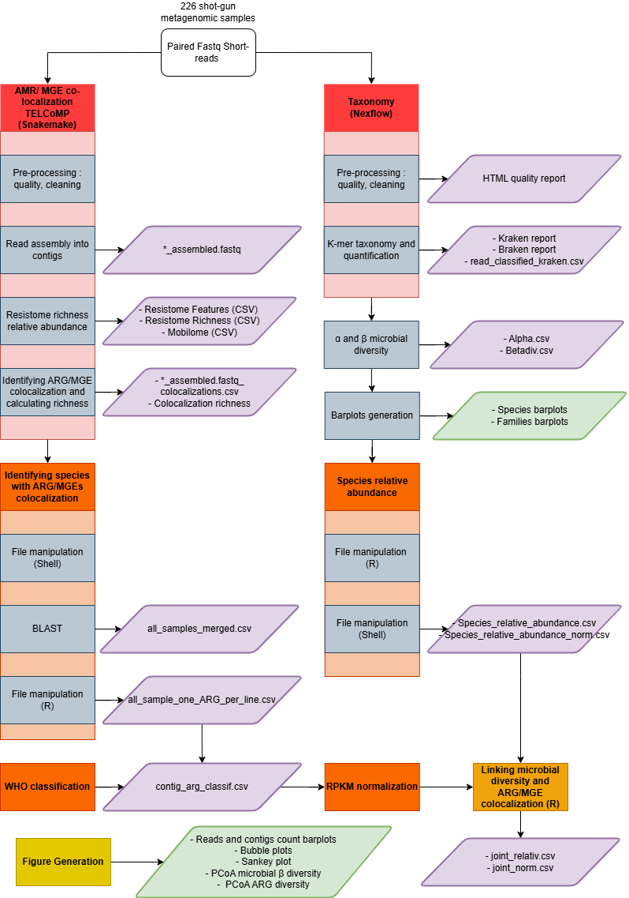

#  🦠 Transferable_AMR_Kefir 🥛
This project aims to determine whether transferable AMR is present in kefir and, if so, to characterize it in terms of relative abundance and diversity. The data used in this project comes from open kefir metagenomic project.

## How to use this Github ?

### Option 1 : The goal is to check the output of the study
Go directly to the folder results. You will find here the plot, main tables and analysis.

### Option 2 : The goal is to reproduce the output or use the workflow with other data
0- Download this Github. You can empty the result folder  
1- Folow the 'Data and workspace implementation' instruction below to prepare the data and R setup.  
2- Follow the 'TELCoMB' instruction below to install the Snakemake workflow and run it  
3- Follow the 'Taxonomy' instruction below to install the Nextflow workflow  
4- Follow the 'Merging Colocalization and taxonomy' instruction below to associate the AMR to a species  
5- Follow the 'Visual representation' below to generate plots

## Workflow


## Data and workspace implementation
### Data
Create a sample_metadata.csv file. To extract the SRA ID and metadata from the Bioproject name (replace BIOPROJECT by the name of your Bioproject, ex : PRJEB65292)
```
curl "https://trace.ncbi.nlm.nih.gov/Traces/sra-db-be/runinfo?acc=BIOPROJECT" \
> BIOPROJECT_runinfo.csv

awk -F',' 'NR==1 || /BIOPROJECT/' BIOPROJECT_runinfo.csv \
> tmp.csv

awk -F',' 'BEGIN{OFS=","} 
NR==1{print "BioProject","Run","Platform","Model","LibraryStrategy","Description"} 
NR>1{print $22,$1,$19,$20,$13,$29}' tmp.csv \
> BIOPROJECT_clean.csv

awk -F',' 'BEGIN{OFS=","} NR==1{$(NF+1)="BioProject"} 
NR>1{$(NF+1)="BIOPROJECT"}1' BIOPROJECT_clean.csv \
> final_BIOPROJECT.csv
```
Combine the different final_BIOPROJECT.csv into 1 single sample_metadata.csv.  
Write a sample.txt file with only the SRA names.  
To download the sequences, run : fastq_data/fastq.sh  

### Workspace
Download the necessary packages :
```
mkdir -p ~/R/library
export R_LIBS_USER=~/R/library
R 
options(repos="https://cloud.r-project.org")
install.packages(c("data.table","dplyr","ggplot2","tidyr","forcats","RColorBrewer","viridis" ))
```

## TELCoMB
This part aims to charaterize the colocalization of resistome and mobilome in complex microbial communities such as kefir.
Snakemake workflow made by Jonathan Bravo et al., 2024. Useful links :  
- Github : https://github.com/jonathan-bravo/TELCoMB
- Paper : https://pmc.ncbi.nlm.nih.gov/articles/PMC11620000/#ABS1

### Installation
```
mamba create -c conda-forge -c bioconda -n telcomb snakemake git  
conda activate telcomb  
git clone https://github.com/jonathan-bravo/TELCoMB  
```

### Dataset loading
Replace PATH_TO_SAMPLES to your folder with fastq dataset.
```
cd TELComB  
mamba activate telcomb  
mkdir -p work_dir/samples work_dir/logs  
cp PATH_TO_SAMPLES work_dir/samples
```

### Run
In the file 'config/config.json' make sure the name and path to the folder with the sequences ('WORKDIR') is right. 
```
snakemake --use-conda --conda-frontend mamba --cores 10  
```
### Number of ARGs in colocalization with MGE(s)
To get a file with the colocalization richness of all samples in one. In the terminal in the folder with the TELCoMB output : 
```
printf "sample\tcolocalizations\n" > summary_colocalizations.tsv

for f in *_colocalizations_richness.csv; do
  sample="${f%%_assembled.fastq_colocalizations_richness.csv}"
  awk -F',' -v s="$sample" 'NR==1 {gsub(/[[:space:]]/, "", $2); print s "\t" $2}' "$f"
done >> summary_colocalizations.tsv
```
### Blast
This part is not part of the initial TELcOMB pipeline designed by Bravo et al.  
The identification of the species per ARG is done only on the first ARG found in each contig.

1- In the folder with the files "*__assembled.fastq_colocalizations.csv" (Telcomb/out): Extract contigs's name and the sequence
```
for f in *__assembled.fastq_colocalizations.csv; do
    sample=${f%%__assembled.fastq_colocalizations.csv}
    awk -F',' 'NR>1 {print ">"$1}' "$f" > "${sample}_contig_coloc.fasta"
done
```
2- In Telcomb/Blast run the files 1 to 5. Make sure the input file is pointing to the right place. This will generates the file 'all_samples_merged.csv' with the sample, the contig with an ARG, infos on the ARG and the species found with the blast.

### RPKM
This module computes an estimation of the RPKM (Reads Per Kilobase per Million reads) values for ARGs across samples. It integrates coverage and count data to normalize gene abundance and enable comparisons between samples.
Hypothesis : Uniform coverage along contig.

In the folder workflow/rpkm run the scripts following their numbers.
For visualization, run the scripts : violon_plot_*.R in workflow/plot_stats/rpkm

## Taxonomy 
This part aims to characterize the microbial diversity in kefir.

This workflow uses Nexflow. To download it via Conda :
### Installation
```
conda create --name nf-env bioconda::nextflow
source activate nf-env
export NXF_HOME=$HOME/.nxfhome
mkdir -p $HOME/.nxfhome
```

Then, add the sequences directly to the folder 'data/raw' or use symbolic links.  
And go to the data folder and download the 'Host' and 'Kraken' database : 

### Host 
Here 2 host species were used for the decontamination using a ready to use bowtie2 database : 
- The Human : GRCh38_noalt_as
- Bovins : ARS-UCD1.2
```
cd host
wget https://genome-idx.s3.amazonaws.com/bt/GRCh38_noalt_as.zip
unzip GRCh38_noalt_as.zip
wget https://s3.amazonaws.com/igenomes.illumina.com/Bos_taurus/Ensembl/Btau_4.0/Bos_taurus_Ensembl_Btau_4.0.tar.gz
unzip Bos_taurus_Ensembl_Btau_4.0.tar.gz
```
  
### Download the kraken db
```
cd kraken  
wget https://genome-idx.s3.amazonaws.com/kraken/k2_pluspfp_16_GB_20260226.tar.gz  
tar -xvzf pluspfp_16_*.tar.gz  
```

### Run main 
```
Conda activate 
NXF_CONDA_ENABLED=true nextflow run main.nf -resume
```
Remove '-resume' if you want to start from scratch.

### Run alpha and beta microbial diversity
The 'alpha_diversity.py' and 'beta_diversity' scripts were made by Jennifer Lu et al., 2019. 
Execute the following lines to calculate them :
```
# Alpha diversity
echo "sample,alpha,value" > alpha.csv
for f in results/kraken/*/*.bracken; do
  sample=$(basename "$f" .bracken)
  value=$(python alpha_diversity.py -f "$f" -a Sh)
  echo "${sample},Sh,${value}" >> alpha.csv
done

# Beta diversity, Bray-curtis dissimilarity matrix
mapfile -d '' bracken_files < <(find results/kraken -type f -name "*.bracken" -print0)
python beta_diversity.py -i "${bracken_files[@]}" --type bracken > braken.txt
```

### To visualize the microbial composition
Plotting barplot at species and family level : 20 samples per graph for more visibility.
```
Rscripts taxonomy/visu_families.R
Rscripts taxonomy/visu_species.R
```

## Merging Co-localization and taxonomy

To get a file ("species_relative_abundance.csv" ) with every species that represent more then 0.005% of each sample. Not normalized. 
```
Rscripts taxonomy/abundancy_csv.R
```

### Formatting data
To clean the input file and write 1 ARG per line (and not 1 sample with x ARGs per line) :
```
Rscripts merging/files_manip/manip_file.R
```
Input : samples_taxo_coloc.csv -> This is the file 'all_samples_merged.csv' but with only the colomns : sample,read,ARG,MGE(s),blast_species. The changes were made on Excel.
Output : "all_sample_one_ARG_per_line"

To join the Blast Telcomb output and Taxonomy output : for every species with ARGs found wih Blast, the abundance of each species within every sample is mention. The abundance intrasample, i.e  mean abundance conditional on the presence, and the abundance intersample, i.e the frequency of presence of the species between the samples, is calculated.
```
Rscripts merging/files_manip/join.R.R
```
Output : 'joint_relativ.csv' and 'joint_norm.csv'

## Visual representation
To visualize the output, some graphs can be generated in the "workflow/plot_stats" directory. To avoid repetition and heaviness, he input files to generate the graphs were not put with the according script, only the names. 
The AMRs are often classified according to the WHO antibiotics classification. 

### Reads and contigs count
To get the number of reads per sample :  
Add the localisation of the fastq files in reads.sh and run it.  

To get the numbers of classified reads by Kraken generated with the 'taxonomy workflow' :  
Add the localisation of the kraken files in reads_classified.sh and run it.

To get the numbers of contigs generated with TELCoMB :  
Add the localisation of the '*_reads_length.json' in nbrcontig.sh and run it.  

To create barplot of the number of reads per samples, number of cleaned reads generated with taxonomy workflow per samples and number of contigs generated with TELCoB workflow per samples : run the R scripts in merging/reads_contigs 
```
Rscripts plot_stats/reads_contigs/nbr_contigs.R
Rscripts plot_stats/reads_contigs/nbr_reads.R
Rscripts plot_stats/reads_contigs/nbr_reads_classified.R
```

### Bubble plot
Input : "all_sample_one_ARG_per_line" and  "all_samples_one_ARG_per_line-AMR_who"  
3 types of plot :
- With every ARGs detected
```
Rscripts plot_stats/bubble_plot/bubble.R
```
- With only the ARGs for antibiotics :
```
Rscripts plot_stats/bubble_plot/bubble_nometal.R
```
- With only the ARGS for antibiotics colored according to the WHO antibiotics classification
```
Rscripts plot_stats/bubble_plot/bubble_who.R
```

### Sankey plot
To plot ARG -> Samples (colored by metadata) :
```
Rscripts plot_stats/sankey/Exposition.R
```

To plot ARG -> Species, Species -> Samples, ARG -> Species -> Samples :
```
Rscripts plot_stats/sankey/Sankey_split.R
```

### PCoA and PCA
For statistics and visualization of the alpha and beta microbial diversity : 
```
Rscripts plot_stats/PCA_PCoA/diversiy.R
```

Run the following script to :
- Performe a PCA on ARG count,
- Calculates the Beta diveristy using the Bray-Curtis index for ARGs antibiotics classified according to the WHO as "Authorized for use in humans only",
- Visualize the beta ARGs diversity thanks to a PCoA plot
```
Rscripts plot_stats/PCA_PCoA/multivariate_arg.R
```


